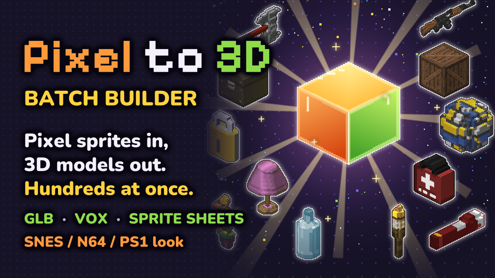

# Pixel to 3D Batch Builder

Turn flat pixel-art sprites into 3D models, lots at once. Drop in a folder of sprites (up to 128 × 128 pixels each), tell the program how thick each one is and roughly what shape, and get back low-poly **GLB** models, **MagicaVoxel** `.vox` models and extra 2D art: rendered sprite sheets from any angle, spinning turntable GIFs, side pictures, sprite stacks and palettes. The look is SNES / N64 / PS1, with optional modern touches like normal maps.



## How it works

1. **Sprites → Sheets.** Every sprite becomes a *sheet*: six pictures of the object, one per side, worked out from your drawing and the shape you picked (box, tube, ball, gem, …).
2. **Paint (optional).** Open a sheet in your usual art program (Aseprite, Paint.NET, …) and fix whatever the program couldn't guess: a handle, a hole, a detail on the back. The program reloads it the moment you save.
3. **Sheets → Models.** Tick the exports you want and press one button. Every model of the batch is built and saved.

It's meant for rough drafts and quick prototypes: a good starting point for further work, or good enough as it is for retro-style games, mods and game jams.

## Getting started

1. Get the zip from [itch.io](https://reactorcore.itch.io/) and unzip it anywhere. No installing; the program and everything it saves stay in its folder.
2. Run **Pixel to 3D Batch Builder.exe**. If Windows says "Windows protected your PC", click **More info** → **Run anyway** (the program isn't signed with a paid certificate).
3. The first start opens an example batch of 71 sprites. Hover anything for an explanation, and press the **❔** button for the full guide.

Needs Windows 10 or 11 (64-bit) with Microsoft WebView2, which Windows 11 and up-to-date Windows 10 already have.

## What's in the folder

- `Pixel to 3D Batch Builder.exe`: the program.
- `guide/`: the user guide (`user-guide.html`) and "How to paint a sheet" (`paint-a-sheet.html`). Open them in any browser.
- `examples/`: the example sprites, sheets and session.
- `presets/`: sprite set presets, inside-style colours and palettes. Your own presets are saved here too.
- `godot-preview/`: a ready-made Godot 4 project for looking at your models under real game lighting, with its own beginner guide.
- `cli/p3d.mjs` and `CLI.md`: a command-line version, mainly for AI helpers such as Claude and for scripts. Needs [Node.js](https://nodejs.org).
- `promo/`: pictures of the program.
- `settings/`: appears after the first start; holds the autosave. Delete it to start fresh.

## Licence

Pixel to 3D Batch Builder is a paid program whose source code is public on GitHub. It's distributed under a **Commercial License with Source Code Access** (full text in `LICENSE.md`).

**What you CAN do:**
- Use the program for personal and commercial projects
- View and study the source code, for example to check it's safe
- Modify the source code for your own personal use

**What you CANNOT do:**
- Redistribute, resell or sublicense the program or any modified version of it
- Use it as a component of another commercial product
- Share your copy with others (each user needs their own copy)

**What you make with it is yours.** Models, sheets and sprites made from your own art belong to you, for any use, commercial included.

**The example sprites** in `examples/` are by Reactorcore and released as CC0 (public domain): use them for anything.

**Third-party parts:** the fonts Pixelify Sans and Nunito (SIL Open Font License), three.js (MIT), manifold-3d (Apache 2.0), fflate (MIT), Tauri (MIT / Apache 2.0), and the Doom palette in `presets/palettes/doom.hex`, taken from Freedoom (BSD licence). They keep their own licences.

## Contact

mailto:reactorcoregames@gmail.com

---

Check out everything else I do: ✨🚀

https://linktr.ee/reactorcore

https://reactorcore.itch.io/

-Reactorcore

---

My other links:
Home/Links: https://linktr.ee/reactorcore
Releases: https://reactorcore.itch.io
Blog: https://www.patreon.com/ReactorcoreGames
Discord: https://discord.gg/UdRavGhj47
Catalog: https://reactorcoregames.github.io/

---

## For developers

`DESIGN.md` is the design (with an "as built" record of every part), `checklist-todo.md` the build plan and progress, and `CLAUDE.md` a map of the project.

```
npm install
npm run dev        # the app in the browser at http://localhost:5173
npm test           # core library and command-line tests (Vitest)
npm run build      # typecheck + production build into dist/
npm run desktop    # the desktop app (Tauri) in a window, with the dev server behind it
npm run desktop:build      # the release exe: src-tauri/target/release/Pixel to 3D Batch Builder.exe
npm run desktop:installer  # the same plus an NSIS installer (downloads NSIS the first time; not shipped)
npm run cli:build  # the command-line tool: cli/p3d.mjs, one file that runs with plain node (see CLI.md)
build_release.bat  # everything above for a release: release\Pixel to 3D Batch Builder\ and its zip
```

The desktop app needs Rust (rustup, MSVC toolchain), Visual Studio's C++ build tools with a Windows SDK, and WebView2 (part of Windows 11). The program is portable: the exe looks for `presets/`, `examples/` and `guide/` next to it (or in a folder above it, which is how `npm run desktop` finds the project's own; the guide is `public/guide/` while developing), and keeps its autosave and WebView2 data in a `settings/` folder beside itself. On its very first start it opens `examples/Example session.p3d.json`; `node scripts/make-examples.mjs <session file>` rebuilds `examples/` from a browser session file. The exe can be started with a session file or pictures and folders as arguments (`"Pixel to 3D Batch Builder.exe" props.p3d.json`).

### Layout

- `src/core/`: the UI-free library (RGBA pixel buffers in, files out). The browser UI and the command-line tool sit on top of it; `src/core/exports.ts` is the export path both share, so they make the same files.
- `src/cli/`: the command-line tool (`p3d`), bundled by `vite.cli.config.ts` into `cli/p3d.mjs` (not in git; a build output). `CLI.md` is its usage doc, written for Claude using the tool from another project.
- `src/ui/`: the interface, first ported from a clickable HTML mockup. `index.html` and `src/ui/style.css` are the page and styles. `src/ui/desktop.ts` is the only module that talks to Tauri; the rest branches on `isDesktop` where the browser and the desktop app differ.
- `src-tauri/`: the desktop shell (Rust): file reading and writing by path, folder listing, the presets folder, the guide pages, the autosave file and watching loaded pictures (`src/lib.rs`). Its icons are the files in `branding/`, used as they are.
- `public/guide/`: the user guide and the sheet-painting guide, plain HTML pages with their own copy of the Nunito font, opened in the browser from the app and shipped as `guide/` in the release.
- `presets/`: sprite set presets (one JSON file each), the inside-style colours and fixed palettes. Adding a JSON file to `presets/sprite-sets/` adds a preset.
- `godot-preview/`: a ready-to-use Godot 4.7 project that shows exported GLBs under real engine lighting, with switches for each surface-detail map. `godot-preview/model-preview-in-godot-guide.html` walks through it from downloading Godot.
- `public/fonts/`: Pixelify Sans and Nunito, bundled so the app works offline.
- `promo/`: finished promo images. `promo tools/`: the scripts that made them (`make_icon_og.py`, `make_showcase_sheets.py`, `make_cover_thumb.py`, `make_one_sprite_infographic.py` with its small renderer `render3d.py`).
- `tests/`: core library and command-line tool tests (`tests/fixtures/gui-run-hashes.json` holds the files of two GUI runs that the tool must match; see the top of `tests/cli.test.ts`). The main test sprites are in `test sprites/PSRC Starter Pack Sprites/`, and `test sprites/untitled.p3d.json` is a session with per-row settings tuned for them; `tests/fixtures/phase2 test sheets/` holds painted sheets for trying split planes and cut-off paint in ② (made by `tests/painted.ts`); `tests/fixtures/ends test sprites/` holds a bullet drawn from the side, a stake and a bullet drawn end-on, for trying Ends (Tube ↔ right end, Diamond ↕ bottom end, Tube ⊙ front end); `test sprites/Stress Test Shapes 128px/` holds 128 × 128 noise-filled shapes for checking big, awkward outlines; `test sprites/Game Preset Comparison Results/` shows each sprite set preset rendered next to the game it imitates (the reference sprites are in its `Real Game Refs/`; `make_comparisons.py` there remakes the sheets, plus voxel versions, a Look settings sheet, camera experiments and turntable GIFs in `Render Variations/`). `WRITE_TEST_VOX=1 npx vitest run tests/exports.test.ts` writes sample `.vox` files for opening in MagicaVoxel to `tests/out/vox test files/`.
